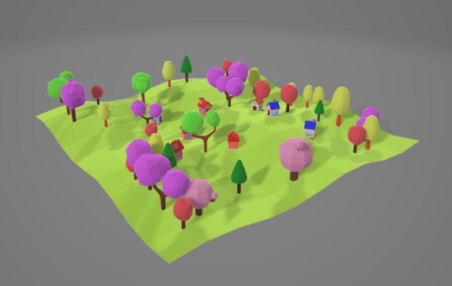

# Art-Py Lab – Blender + Python Worldbuilding

**Overview**  
This project explores **creative automation and 3D worldbuilding** using Python scripts in Blender. It combines coding and design to generate scenes, animations, and data-driven visuals. Outputs include procedural landscapes, stock-driven motion graphics, and example immersive scenes.

---

## Strategies Explored

- **Python Scripting** – automated Blender workflows for generating and animating 3D objects.  
- **Generative Scenes** – procedural landscapes and populated worlds built directly from code.  
- **Animation** – custom animations including a stock movement visualization driven by real market data.  
- **Immersive Design** – example 3D `.blend` files showcasing colorful, low-poly worlds and creative layouts.  

---

## Outputs

- Example 3D scene:  
    

- Animated stock movement demo  
- Procedural world `.blend` files  

---

👉 To include images in your README, place them in your repo (e.g. in an `assets/` folder) and reference them like this:

```markdown

```
